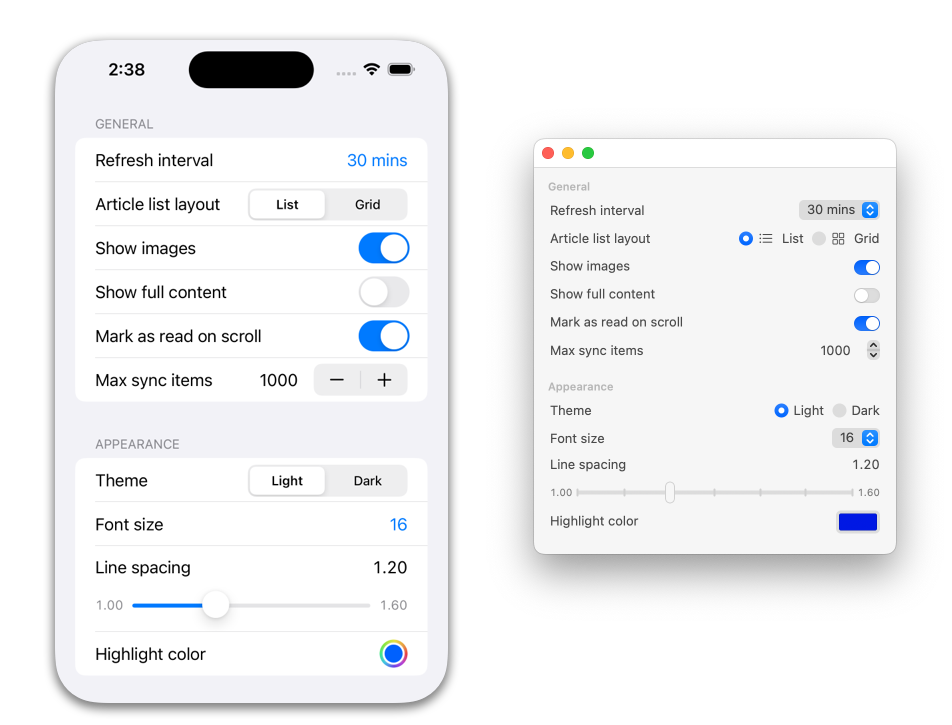

<p align="center">
    
</p>

<p align="center">
    
    <a href="https://swift.org/package-manager">
        
    </a>
     
    <a href="mastodon.social/@caddy">
        
    </a>
</p>

Welcome to **DCSettings**, a Swift package designed to help manage user preferences and provide a simple drop-in user interface.

<table>
  <tr>
    <td>
      <pre><code>
        DCSettingsManager.shared.configure {
            DCSettingGroup("general") {
                DCSetting(key: "refreshInterval") {
                    DCSettingOption(value: 5, label: "5 mins")
                    DCSettingOption(value: 10, label: "10 mins")
                    DCSettingOption(value: 15, label: "15 mins")
                    DCSettingOption(value: 30, label: "30 mins", isDefault: true)
                    DCSettingOption(value: 60, label: "60 mins")
                }
                DCSetting(key: "articleListLayout", label: "Article List Layout") {
                    DCSettingOption(value: "List", label: "List", systemImage: "list.bullet")
                    DCSettingOption(value: "Grid", label: "Grid", systemImage: "square.grid.2x2")
                }
                DCSetting(key: "showImages", defaultValue: true)
                DCSetting(key: "showFullContent", defaultValue: false)
                DCSetting(key: "markAsReadOnScroll", defaultValue: true)
            }
            DCSettingGroup("appearance") {
                DCSetting(key: "theme", label: "Theme", options: ["Light", "Dark"], defaultIndex: 0)
                DCSetting(key: "fontSize", label: "Font Size", options: [12, 14, 16, 18, 20], defaultIndex: 2)
                DCSetting(key: "lineSpacing", defaultValue: 1.2, label: "Line Spacing", lowerBound: 1.0, upperBound: 1.6, step: 0.1)
                DCSetting(key: "highlightColor", defaultValue: Color.blue)
            }
        }
    </code></pre>
    </td>
    <td>
      
    </td>
  </tr>
</table>

## Installation

To install DCSettings, add the following line to your `Package.swift` file:

```swift
dependencies: [
    .package(url: "https://github.com/davidcaddy/DCSettings.git", from: "1.0.0")
]
```

## Usage

To use DCSettings in your project, you’ll need to import it at the top of your Swift file like so:

```swift
import DCSettings
```

### Configuring Settings

To configure settings, you can use the DCSettingsManager.shared.configure method. This method takes a closure that returns an array of DCSettingGroup instances. Each DCSettingGroup can contain multiple DCSetting instances.

Here’s an example of how you might configure your settings:

```swift
DCSettingsManager.shared.configure {
    DCSettingGroup(key: "General") {
        DCSetting(key: "ShowNotifications", defaultValue: true)
        DCSetting(key: "SoundEffects", defaultValue: true)
        DCSetting(key: "ThemeColor") {
            DCSettingOption(value: "Blue", default: true)
            DCSettingOption(value: "Red")
            DCSettingOption(value: "Green")
        }
    }
    .store(.standard)
    DCSettingGroup("Appearance") {
        DCSetting(key: "FontSize", defaultValue: 14)
        DCSetting(key: "FontName", defaultValue: "Helvetica")
    }
}
```

In this example, we’ve created two setting groups: one for general settings and one for appearance settings. In the general settings group, we’ve added three settings: one for showing notifications, one for sound effects, and one for the theme color. The theme color setting has three options: blue (the default), red, and green.

In the appearance settings group, we’ve added two settings: one for the font size and one for the font name.

When configuring your settings using the DCSettingsManager.shared.configure method, you have several options available to you.

First, you can create DCSettingGroup instances to group related settings together. Each DCSettingGroup can have a key and a label. The key is used to uniquely identify the group, while the label is used to provide a human-readable name for the group.

Within each DCSettingGroup, you can create DCSetting instances to represent individual settings. Each DCSetting has a key, a default value, and an optional label. The key is used to uniquely identify the setting, while the default value is used as the initial value for the setting if no value has been previously set. The label is used to provide a human-readable name for the setting.

In addition to these basic properties, DCSetting instances can also have additional configuration options. These options are specified using the DCSettingConfiguration struct.

One of the options available in DCSettingConfiguration is the options property. This property allows you to specify an array of DCSettingOption instances that represent the available options for the setting. Each DCSettingOption has a value and can also have an optional label and image.

Another option available in DCSettingConfiguration is the bounds property. This property allows you to specify a range of valid values for the setting using a DCValueBounds instance. A DCValueBounds instance has a lower bound and an upper bound that define the range of valid values.

Finally, DCSettingConfiguration also has a step property that allows you to specify the increment between valid values for the setting.

Here’s an example that shows how you might configure a setting with options and bounds:

```swift
DCSettingsManager.shared.configure {
    DCSettingGroup(key: "General") {
        DCSetting(key: "ThemeColor") {
            DCSettingOption(value: "Blue", default: true)
            DCSettingOption(value: "Red")
            DCSettingOption(value: "Green")
        }
        DCSetting(key: "FontSize", defaultValue: 14, lowerBound: 10, upperBound: 20)
    }
}
```

In this example, we’ve created a setting group for general settings and added two settings: one for the theme color and one for the font size. The theme color setting has three options: blue (the default), red, and green. The font size setting has a default value of 14 and a range of valid values from 10 to 20.

### Accessing Settings

Once you’ve configured your settings, you can access them using the @DCStorage property wrapper. Here’s an example of how you might access the ShowNotifications setting from the previous example:

```swift
@DCStorage("ShowNotifications", default: false) var showNotifications
```

In this example, we’ve created a showNotifications property that is backed by the ShowNotifications setting. The default value for this property is false.

You can also access settings directly using the DCSettingsManager.shared.value(forKey:) method. Here’s an example of how you might do this:

```swift
let showNotifications = DCSettingsManager.shared.bool(forKey: "ShowNotifications")
```

In this example, we’re accessing the value of the ShowNotifications setting directly and storing it in a local variable.

## Backing Stores

DCSettings allows you to specify which key-value store to use for each setting group and individual setting. By default, settings use the standard key-value store, which is backed by UserDefaults.standard. However, you can specify a different key-value store by using the store property of a DCSettingGroup or DCSetting.

Here’s an example that shows how to specify a custom key-value store for a setting group:

```swift
DCSettingsManager.shared.configure {
    DCSettingGroup(key: "General") {
        DCSetting(key: "ShowNotifications", defaultValue: true)
        DCSetting(key: "SoundEffects", defaultValue: true)
    }
    .store(.userDefaults(suiteName: "com.example.myapp"))
}
```

In this example, we’ve created a setting group for general settings and specified that it should use a custom key-value store backed by a UserDefaults instance with the suite name "com.example.myapp".

You can also specify a custom key-value store for individual settings. Here’s an example that shows how to do this:

```swift
DCSettingsManager.shared.configure {
    DCSettingGroup(key: "General") {
        DCSetting(key: "ShowNotifications", defaultValue: true)
        DCSetting(key: "SoundEffects", defaultValue: true, store: .userDefaults(suiteName: "com.example.myapp"))
    }
}
```

In this example, we’ve created a setting group for general settings and specified that the SoundEffects setting should use a custom key-value store backed by a UserDefaults instance with the suite name "com.example.myapp".

DCSettings also supports using `NSUbiquitousKeyValueStore` as a key-value store for your settings. NSUbiquitousKeyValueStore is a key-value store that stores data in iCloud, allowing you to share settings between multiple devices.

To use `NSUbiquitousKeyValueStore` as the key-value store for a setting group or individual setting, you can use the .ubiquitous case of the `DCSettingStore` enum. Here’s an example that shows how to specify NSUbiquitousKeyValueStore as the key-value store for a setting group:

```swift
DCSettingsManager.shared.configure {
    DCSettingGroup(key: "General") {
        DCSetting(key: "ShowNotifications", defaultValue: true)
        DCSetting(key: "SoundEffects", defaultValue: true)
    }
    .store(.ubiquitous)
}
```

In this example, we’ve created a setting group for general settings and specified that it should use NSUbiquitousKeyValueStore as its key-value store.

You can also specify NSUbiquitousKeyValueStore as the key-value store for individual settings. Here’s an example that shows how to do this:

```swift
DCSettingsManager.shared.configure {
    DCSettingGroup(key: "General") {
        DCSetting(key: "ShowNotifications", defaultValue: true)
        DCSetting(key: "SoundEffects", defaultValue: true, store: .ubiquitous)
    }
}
```

In this example, we’ve created a setting group for general settings and specified that the SoundEffects setting should use NSUbiquitousKeyValueStore as its key-value store.

## Notes

DCSettings supports the following types by default:

- Bool
- Int
- Double
- String
- Date
- Color (SwiftUI)

### Basic Types

DCSettings supports several built-in value types for settings, including Bool, Int, Double, String, and Date. You can use these types directly when creating DCSetting instances.

In addition to these built-in types, you can also use custom types as the value type for your settings. To do this, your custom type must conform to the Codable protocol. This allows DCSettings to encode and decode your custom type when storing and retrieving setting values.

Here’s an example that shows how you might create a custom type that conforms to the Codable protocol:

```swift
struct MyCustomType: Codable {
    let name: String
    let age: Int
}
```

In this example, we’ve created a MyCustomType struct that has two properties: name and age. We’ve also made this struct conform to the Codable protocol by adding an empty conformance.

Once you’ve created your custom type, you can use it as the value type for a DCSetting. Here’s an example that shows how you might do this:

```swift
DCSettingsManager.shared.configure {
    DCSettingGroup(key: "General") {
        DCSetting(key: "MyCustomSetting", defaultValue: MyCustomType(name: "John", age: 30))
    }
}
```

### Color (SwiftUI)
In addition to the basic built-in value types discussed above, DCSettings also supports using `Color` from `SwiftUI` as the value type for settings. This allows you to create settings that allow the user to choose a color.

Here’s an example that shows how you might create a DCSetting with a Color value type:

```swift
DCSettingsManager.shared.configure {
    DCSettingGroup(key: "Appearance") {
        DCSetting(key: "ThemeColor", defaultValue: Color.blue)
    }
}
```

In this example, we’ve created a setting group for appearance settings and added a setting with the key "ThemeColor". The value type for this setting is Color. We’ve specified a default value for this setting of Color.blue.

When this setting is displayed within a DCSettingsView, it will be displayed as a color picker that allows the user to choose a color.

In this example, we’ve created a setting group for general settings and added a setting with the key "MyCustomSetting". The value type for this setting is our custom MyCustomType type. We’ve specified a default value for this setting of MyCustomType(name: "John", age: 30).

Here’s an example that shows how you might create settings using all of the supported value types:

```swift
DCSettingsManager.shared.configure {
    DCSettingGroup(key: "General") {
        DCSetting(key: "ShowNotifications", defaultValue: true)
        DCSetting(key: "FontSize", defaultValue: 14)
        DCSetting(key: "Volume", defaultValue: 0.5)
        DCSetting(key: "Username", defaultValue: "JohnDoe")
        DCSetting(key: "Birthday", defaultValue: Date())
        DCSetting(key: "ThemeColor", defaultValue: Color.blue)
    }
}
```

In this example, we’ve created a setting group for general settings and added several settings using different value types. The "ShowNotifications" setting has a Bool value type, the "FontSize" setting has an Int value type, the "Volume" setting has a Double value type, the "Username" setting has a String value type, the "Birthday" setting has a Date value type, and the "ThemeColor" setting has a Color value type.

When these settings are displayed within a DCSettingsView, they will be displayed using appropriate controls for their respective value types. For example, the "ShowNotifications" setting will be displayed as a toggle switch, while the "Volume" setting will be displayed as a slider.

## DCSettingsView

The SwiftUI code you provided includes several view types that make it easy to quickly add a settings view to your app.

The main view type is DCSettingsView. This view displays a list of all the setting groups and settings that you’ve configured using the DCSettingsManager.shared.configure method. You can create an instance of this view and add it to your app’s view hierarchy like any other SwiftUI view.

Here’s an example that shows how you might create and use a DCSettingsView:

```swift
struct ContentView: View {
    var body: some View {
        DCSettingsView()
    }
}
```

In this example, we’ve created a ContentView that contains a DCSettingsView. When this view is displayed, it will show a list of all the setting groups and settings that you’ve configured.

DCSettingsView has several customization options available. For example, you can specify an array of hidden keys to hide certain setting groups or individual settings. You can also provide a custom content provider to control how each setting is displayed.

Here’s an example that shows how you might customize a DCSettingsView:

```swift
struct ContentView: View {
    var body: some View {
        DCSettingsView(hiddenKeys: ["General"])
    }
}
```

In this example, we’ve created a ContentView that contains a DCSettingsView. We’ve specified that the “General” setting group should be hidden by passing an array of hidden keys to the DCSettingsView initializer.

### Types

When you use a DCSettingsView to display your settings, each setting will be presented to the user using an appropriate control for its value type. Here’s a description of how each value type is presented:

- `Bool`: Settings with a Bool value type are presented as a toggle switch. The user can tap the switch to turn the setting on or off.
- `Int`: Settings with an Int value type are presented in several different ways depending on their configuration. If the setting has options, it will be presented as a segmented control or a menu (depending on the number of options). If the setting has value bounds, it will be presented as a slider. Otherwise, it will be presented as a stepper control.
- `Double`: Settings with a Double value type are presented as a slider. The user can drag the slider to adjust the value of the setting.
- `String`: Settings with a String value type are presented in several different ways depending on their configuration. If the setting has options, it will be presented as a segmented control or a menu (depending on the number of options). Otherwise, it will be presented as a text field.
- `Date`: Settings with a Date value type are presented as a date picker. The user can tap the date picker to choose a date.
- `Color`: Settings with a Color value type are presented as a color picker. The user can tap the color picker to choose a color.

### DCSettingViewProviding

`DCSettingViewProviding` is a protocol that allows you to provide custom views for individual settings within a DCSettingsView. To use this protocol, you’ll need to create a type that conforms to it and implement the content(for:) method.

The content(for:) method takes a DCSettable instance as its argument and returns an optional view. If you return a view from this method, it will be used to display the setting in the DCSettingsView. If you return nil, the default view for the setting will be used.

Here’s an example that shows how you might create a custom DCSettingViewProviding type:

```swift
struct MySettingViewProvider: DCSettingViewProviding {
    @ViewBuilder func content(for setting: any DCSettable) -> some View {
        if setting.key == "ShowNotifications" {
            Toggle("Show Notifications", isOn: setting.valueBinding())
        }
    }
}
```

In this example, we’ve created a MySettingViewProvider type that conforms to the DCSettingViewProviding protocol. In our implementation of the content(for:) method, we’re checking if the key of the setting is "ShowNotifications". If it is, we’re returning a custom toggle view for the setting. For all other settings, we’re returning nil, which means that the default view for those settings will be used.

Once you’ve created your custom DCSettingViewProviding type, you can pass an instance of it to the DCSettingsView initializer to use it. Here’s an example that shows how you might do this:

```swift
struct ContentView: View {
    var body: some View {
        DCSettingsView(contentProvider: MySettingViewProvider())
    }
}
```

In this example, we’ve created a ContentView that contains a DCSettingsView. We’ve passed an instance of our custom MySettingViewProvider type to the DCSettingsView initializer to use it as the content provider for the view.

When configuring a DCSetting, you can provide several additional options that affect how the setting is displayed within a DCSettingsView.

- `label`: The label property allows you to specify a human-readable name for the setting. This label is displayed next to the control for the setting within the DCSettingsView.
- `image`: The image property allows you to specify the name of an image to display next to the label for the setting within the DCSettingsView. This image should be included in your app’s asset catalog.
- `systemImage`: The systemImage property allows you to specify the name of a system-provided image to display next to the label for the setting within the DCSettingsView. This image should be one of the system-provided SF Symbols.
- `value bounds`: The value bounds property allows you to specify a range of valid values for the setting. If you provide value bounds for a setting, the control for that setting within the DCSettingsView will be constrained to only allow values within that range. For example, if you provide value bounds for a numeric setting, the control for that setting will be a slider that only allows values within the specified range.
- `step`: The step property allows you to specify the increment between valid values for a numeric setting. If you provide a step value for a numeric setting, the control for that setting within the DCSettingsView will only allow values that are multiples of the step value.
Here’s an example that shows how you might configure a DCSetting with some of these options:

```swift
DCSettingsManager.shared.configure {
    DCSettingGroup(key: "General") {
        DCSetting(key: "ThemeColor", label: "Theme Color", systemImage: "paintbrush") {
            DCSettingOption(value: "Blue", default: true)
            DCSettingOption(value: "Red")
            DCSettingOption(value: "Green")
        }
        DCSetting(key: "FontSize", defaultValue: 14, lowerBound: 10, upperBound: 20, step: 2)
    }
}
```

In this example, we’ve created a setting group for general settings and added two settings: one for the theme color and one for the font size. The theme color setting has a label of "Theme Color" and a system image of "paintbrush". The font size setting has a default value of 14, value bounds from 10 to 20, and a step value of 2.

When these settings are displayed within a DCSettingsView, the theme color setting will have a label of "Theme Color" and an icon of a paintbrush next to it. The font size setting will be displayed as a slider that only allows values from 10 to 20 in increments of 2.

## Result Builder

When configuring settings and groups using the DCSettingsManager.shared.configure method, you can use a special syntax called “result builder” syntax (previously known as “function builder” syntax) to create your setting groups and settings.

Result builder syntax allows you to write your configuration code in a more declarative and readable way. Instead of creating DCSettingGroup and DCSetting instances directly using their initializers, you can use a more concise syntax that looks similar to SwiftUI view declarations.

Here’s an example that shows how you might configure your settings using result builder syntax:

```swift
DCSettingsManager.shared.configure {
    DCSettingGroup(key: "General") {
        DCSetting(key: "ShowNotifications", defaultValue: true)
        DCSetting(key: "SoundEffects", defaultValue: true)
        DCSetting(key: "ThemeColor") {
            DCSettingOption(value: "Blue", default: true)
            DCSettingOption(value: "Red")
            DCSettingOption(value: "Green")
        }
    }
}
```

In this example, we’re using result builder syntax to create a DCSettingGroup with the key "General". Within this group, we’re creating three DCSetting instances for the "ShowNotifications", "SoundEffects", and "ThemeColor" settings. The "ThemeColor" setting has three options: blue (the default), red, and green.

This code is equivalent to the following code that doesn’t use result builder syntax:

```swift
DCSettingsManager.shared.configure {
    let themeColorOptions = [
        DCSettingOption(value: "Blue", default: true),
        DCSettingOption(value: "Red"),
        DCSettingOption(value: "Green")
    ]
    let themeColorConfiguration = DCSettingConfiguration(options: themeColorOptions, bounds: nil, step: nil)
    let themeColorSetting = DCSetting(key: "ThemeColor", value: "Blue", label: nil, configuation: themeColorConfiguration, store: nil)
    
    let showNotificationsSetting = DCSetting(key: "ShowNotifications", defaultValue: true)
    let soundEffectsSetting = DCSetting(key: "SoundEffects", defaultValue: true)
    
    let generalGroup = DCSettingGroup(key: "General", label: nil, store: .standard, settings: [showNotificationsSetting, soundEffectsSetting, themeColorSetting])
    
    return [generalGroup]
}
```

As you can see, using result builder syntax makes your code much more concise and readable.

## Custom Backing Store

In addition to the built-in key-value stores provided by DCSettings (standard, userDefaults, and ubiquitous), you can also create your own custom key-value store by creating a type that conforms to the DCKeyValueStore protocol.

The DCKeyValueStore protocol defines several methods that your custom key-value store must implement. These methods allow DCSettings to store and retrieve setting values using your custom key-value store.

Here’s an example that shows how you might create a custom key-value store that stores setting values in a dictionary in memory:

```swift
class MyCustomKeyValueStore: DCKeyValueStore {
    var storage = [String: Any]()
    
    var changeNotificationName: NSNotification.Name {
        return .init("MyCustomKeyValueStoreDidChange")
    }
    
    func set(_ value: Any?, forKey key: String) {
        storage[key] = value
        NotificationCenter.default.post(name: changeNotificationName, object: self)
    }
    
    func object(forKey key: String) -> Any? {
        return storage[key]
    }
    
    func set(_ value: Bool, forKey key: String) {
        set(value as Any?, forKey: key)
    }
    
    func bool(forKey key: String) -> Bool {
        return object(forKey: key) as? Bool ?? false
    }
    
    func set(_ value: Int, forKey key: String) {
        set(value as Any?, forKey: key)
    }
    
    func integer(forKey key: String) -> Int {
        return object(forKey: key) as? Int ?? 0
    }
    
    func set(_ value: Double, forKey key: String) {
        set(value as Any?, forKey: key)
    }
    
    func double(forKey key: String) -> Double {
        return object(forKey: key) as? Double ?? 0.0
    }
    
    func string(forKey key: String) -> String? {
        return object(forKey: key) as? String
    }
    
    @discardableResult func synchronize() -> Bool {
        return true
    }
}
```

In this example, we’ve created a MyCustomKeyValueStore class that conforms to the DCKeyValueStore protocol. This class uses a dictionary to store setting values in memory. We’ve implemented all of the required methods of the DCKeyValueStore protocol to allow DCSettings to store and retrieve setting values using our custom key-value store.

Once you’ve created your custom key-value store type, you can use it when configuring your settings by specifying it as the store for a DCSettingGroup or individual DCSetting. Here’s an example that shows how you might do this:

```swift
let myCustomKeyValueStore = MyCustomKeyValueStore()

DCSettingsManager.shared.configure {
    DCSettingGroup(key: "General") {
        DCSetting(key: "ShowNotifications", defaultValue: true)
        DCSetting(key: "SoundEffects", defaultValue: true)
    }
    .store(.custom(backingStore: myCustomKeyValueStore))
}
```

In this example, we’ve created an instance of our custom MyCustomKeyValueStore class and used it as the store for a DCSettingGroup. This means that all of the settings within this group will use our custom key-value store to store and retrieve their values.
