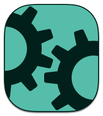

<p align="center">
    
</p>

<p align="center">
    
    <a href="https://swift.org/package-manager">
        
    </a>
     
    <a href="https://mastodon.social/@caddy">
        
    </a>
</p>

Welcome to **DCSettings**, a Swift package that simplifies the configuration of user preferences with an easy-to-use result builder syntax and a drop-in SwiftUI settings UI for iOS, macOS, watchOS, and visionOS.

You can configure settings in `UserDefaults`, `NSUbiquitousKeyValueStore` or a custom key-value store, like so:

```swift
DCSettingsManager.shared.configure {
    DCSettingGroup(key: "general", label: "General") {
        DCSetting(key: "refreshInterval") {
            DCSettingOption(value: 5, label: "5 mins")
            DCSettingOption(value: 10, label: "10 mins")
            DCSettingOption(value: 15, label: "15 mins")
            DCSettingOption(value: 30, label: "30 mins").default()
            DCSettingOption(value: 60, label: "60 mins")
        }
        DCSetting(key: "articleListLayout") {
            DCSettingOption(value: "List", label: "List", systemImage: "list.bullet")
            DCSettingOption(value: "Grid", label: "Grid", systemImage: "square.grid.2x2")
        }
        DCSetting(key: "showImages", defaultValue: true)
        DCSetting(key: "showFullContent", defaultValue: false)
        DCSetting(key: "markAsReadOnScroll", defaultValue: true)
        DCSetting(key: "maxSyncItems", defaultValue: 1000)
    }
    DCSettingGroup(key: "appearance", label: "Appearance") {
        DCSetting(key: "theme", label: "Theme") {
            DCSettingOption(value: "Light", label: "Light")
            DCSettingOption(value: "Dark", label: "Dark")
        }
        DCSetting(key: "fontSize", label: "Font Size") {
            DCSettingOption(value: 12, label: "12 pt")
            DCSettingOption(value: 14, label: "14 pt")
            DCSettingOption(value: 16, label: "16 pt").default()
            DCSettingOption(value: 18, label: "18 pt")
            DCSettingOption(value: 20, label: "20 pt")
        }
        DCSetting(key: "lineSpacing", defaultValue: 1.2, lowerBound: 1.0, upperBound: 1.6, step: 0.1)
        #if !os(watchOS)
        DCSetting(key: "highlightColor", defaultValue: Color.blue)
        #endif
    }
}
```

Then use a **DCSettingsView** to display the settings in a list view:


```swift
DCSettingsView()
```

## Installation

To install **DCSettings**, add the following line to your `Package.swift` file:

```swift
dependencies: [
    .package(url: "https://github.com/davidcaddy/DCSettings.git", from: "1.0.0")
]
```

### Requirements

DCSettings requires Swift 6.0 or newer and supports iOS 14, macOS 11, tvOS 14, watchOS 7, and visionOS 2 or newer. The settings configuration and storage APIs are available on tvOS, but `DCSettingView`, `DCSettingsView`, and the default SwiftUI settings UI are not available on tvOS in 1.0. `DCSettingStore.ubiquitous` requires watchOS 9 or newer.

`DCSettingsManager`, `DCSetting`, the stored-value property wrappers, and the SwiftUI settings views are main-actor isolated. Configure, read, and write settings through `DCSettingsManager` from the main actor. The lower-level `DCSettingStore` and `DCKeyValueStore` storage APIs remain actor-neutral.

### Migration Notes

- If you previously read `configuation`, move to `configuration`.
- `DCSettable` conformers must now provide `configuration`.
- `DCSettingStore.set(_:forKey:)` now returns `Bool` to indicate whether the value was persisted.
- `Color` no longer conforms to `Codable` publicly through DCSettings. Color storage is handled internally on platforms with UIKit or AppKit.
- `DCSettingOption.labelView()` is internal in 1.0. Use the option's public `label` and `image` properties, or provide custom option UI through your own views.
- `DCSettingView`, `DCSettingsView`, and `DCSettingViewProviding` are not available on tvOS in 1.0. The core settings and storage APIs still support tvOS.
- `DCStoredValue`, `DCStoredRepresentedValue`, `DCSettingView`, and `DCSettingsView` now expose their main-actor isolation directly in Swift 6. Use them from the main actor.
- `DCSetting` value types must be non-optional, and bounded defaults must satisfy their configured bounds.
- Bounded numeric settings now require `ValueType: Numeric & Comparable`.
- Group keys and setting keys must be unique across configured groups.
- `DCSettingGroup("Label")` now uses the label as the group key. Prefer `DCSettingGroup(key:label:)` when the key is persisted, filtered, localized, or otherwise part of app behavior.
- `DCSettingsView.Filter` now separates `.excludeGroups(_:)` and `.excludeSettings(_:)`; use `.exclude(groupKeys:settingKeys:)` to hide both.
- The fully generic `DCSettingsView(settingsManager:filter:contentProvider:listStyle:)` initializer no longer supplies default `contentProvider` or `listStyle` arguments. Use the convenience initializers, such as `DCSettingsView()`, `DCSettingsView(filter:)`, `DCSettingsView(contentProvider:)`, or `DCSettingsView(listStyle:)`, for the default provider and platform list style.
- `DCDefaultViewProvider.content(for:)` now returns `EmptyView?`, which keeps the default provider as a nil-only placeholder.
- `Text.monospacedDigitIfAvailable()` is no longer public API. Use SwiftUI's `monospacedDigit()` with an availability check in app code if needed.

#### Updating Common 0.3.x Code

If you used the old combined settings-view filter, choose the new key type explicitly:

```swift
// 0.3.x
DCSettingsView(filter: .excludeKeys(["general"]))

// 1.0
DCSettingsView(filter: .excludeGroups(["general"]))
DCSettingsView(filter: .excludeSettings(["showNotifications"]))
DCSettingsView(filter: .exclude(groupKeys: ["general"], settingKeys: ["showNotifications"]))
```

If you set values directly through `DCSettingStore`, decide whether to handle persistence failure:

```swift
let didSave = DCSettingStore.standard.set(value, forKey: "settingKey")
```

Custom `DCSettable` conformers need the correctly spelled configuration property:

```swift
var configuration: DCSettingConfiguration<Value>? { nil }
```

## Usage

To use `DCSettings` in your project, you’ll need to import it at the top of your Swift file like so:

```swift
import DCSettings
```

## Configuring Settings

To configure settings, use the `configure` method on a `DCSettingsManager` instance, typically the shared singleton instance. `DCSettingsManager` is main-actor isolated, so call `configure` from the main actor. This method takes a closure that returns an array of `DCSettingGroup` instances. Each `DCSettingGroup` can contain multiple `DCSetting` instances.

Here’s an example of how you might configure your settings:

```swift
DCSettingsManager.shared.configure {
        DCSettingGroup(key: "general", label: "General") {
        DCSetting(key: "showNotifications", defaultValue: true)
        DCSetting(key: "soundEffects", defaultValue: true)
        DCSetting(key: "themeColor") {
            DCSettingOption(value: "Blue")
            DCSettingOption(value: "Red")
            DCSettingOption(value: "Green")
        }
    }
    .store(.standard)
        DCSettingGroup(key: "appearance", label: "Appearance") {
        DCSetting(key: "fontSize", defaultValue: 14)
        DCSetting(key: "fontName", defaultValue: "Helvetica")
    }
}
```

When configuring your settings you have several options available to you. First, you can create `DCSettingGroup` instances to group related settings together. Each `DCSettingGroup` can have a key and a label. The label is used to provide a human-readable name for the group.

> It is recommended to avoid setting-specific keys for groups.

Within each `DCSettingGroup`, you can create `DCSetting` instances to represent individual settings. Each `DCSetting` has a key, a default value, and an optional label. The key is used to uniquely identify the setting, while the default value is used as the initial value for the setting if no value has been previously set. The label is used to provide a human-readable name for the setting. If no label is provided, a sentence-cased string version of the key will be used as the label.

Group keys and setting keys must be unique across all groups configured in a `DCSettingsManager`.

`DCSettingGroup("General")` uses `"General"` as both the group label and the group key. Prefer `DCSettingGroup(key:label:)` when the key is persisted, filtered, localized, or otherwise part of app behavior. `DCSettingGroup()` uses a generated key and is best reserved for groups that never need stable identity.

> Note: `DCSetting` supports non-optional values for the following types by default: `Bool`, `Int`, `Double`, `String`, `Date`, and `Color` (SwiftUI). `Color` storage is available on platforms with UIKit or AppKit. You can also use custom non-optional types when they conform to `Codable`.

In addition to these basic properties, `DCSetting` instances can also have additional configuration options. These options are specified using the `DCSettingConfiguration` struct.

One of the options available in `DCSettingConfiguration` is the options property. This property allows you to specify an array of `DCSettingOption` instances that represent the valid values for the setting. Values outside this option list are ignored. Each `DCSettingOption` has a value and can also have an optional label and image.

Another configuration option available in `DCSettingConfiguration` is the bounds property. This property allows you to specify a range of valid values for the setting using a `DCValueBounds` instance. A `DCValueBounds` instance has a lower bound and an upper bound that define the range of valid values. Comparable values outside this range are ignored.

Finally, `DCSettingConfiguration` also has a step property that allows you to specify the positive increment used by controls that edit the setting. Bounded `DCSetting` initializers reject non-positive and non-finite step values.

Here’s an example that shows how you might configure a setting with some of these options:

```swift
DCSettingsManager.shared.configure {
    DCSettingGroup(key: "general", label: "General") {
        DCSetting(key: "themeColor") {
            DCSettingOption(value: "Blue", default: true)
            DCSettingOption(value: "Red")
            DCSettingOption(value: "Green")
        }
        DCSetting(key: "fontSize", label: "Font Size") {
            DCSettingOption(value: 10, label: "10 pt")
            DCSettingOption(value: 12, label: "12 pt")
            DCSettingOption(value: 14, label: "14 pt").default()
            DCSettingOption(value: 16, label: "16 pt")
            DCSettingOption(value: 18, label: "18 pt")
            DCSettingOption(value: 20, label: "20 pt")
        }
        DCSetting(key: "lineSpacing", defaultValue: 1.2, lowerBound: 1.0, upperBound: 1.6, step: 0.1)
    }
}
```

In this example, we’ve created a setting group for general settings and added three settings: one for the theme color, one for the font size, and one for line spacing. The theme color and font size settings use explicit options, while the line spacing setting has a range of valid values from 1.0 to 1.6 and an editing increment of 0.1.

## Accessing Settings

Once you’ve configured your settings, you can access them elsewhere using the `DCStoredValue` property wrapper. Here’s an example of how you might access the `showNotifications` setting from the previous example:

```swift
@DCStoredValue("showNotifications") var showNotifications: Bool
```

You can also access settings directly using `DCSettingsManager` convenience methods. Here’s an example of how you might do this:

```swift
let showNotifications = DCSettingsManager.shared.bool(forKey: "showNotifications")
```

## Backing Stores

**DCSettings** allows you to specify which key-value store to use for each setting group and individual setting. By default, settings use the standard key-value store, which is backed by `UserDefaults.standard`. However, you can specify a different key-value store by using the *store* property of a `DCSettingGroup` or `DCSetting`.

Here’s an example that shows how to use a custom key-value store backed by a `UserDefaults` instance with the suite name "com.example.myapp".

```swift
DCSettingsManager.shared.configure {
    DCSettingGroup(key: "general", label: "General") {
        DCSetting(key: "showNotifications", defaultValue: true)
    }
    .store(.userDefaults(suiteName: "com.example.myapp"))
}
```

> Note: If no key-value store is specified for a setting group, the standard key-value store will be used.

You can also specify a custom key-value store for individual settings. Here’s an example that shows how to do this:

```swift
DCSettingsManager.shared.configure {
    DCSettingGroup(key: "general", label: "General") {
        DCSetting(key: "showNotifications", defaultValue: true, store: .userDefaults(suiteName: "com.example.myapp"))
    }
}
```

> Note: If you specify a custom key-value store for a setting group, all settings within that group will use that key-value store, unless you specify a different key-value store for an individual setting.

### Storage contract

DCSettings stores property-list compatible values (`Bool`, `Int`, `Double`, `String`, `Date`, and `Data`) directly in the selected backing store. On platforms with UIKit or AppKit, `Color` values are handled as a built-in type and stored as JSON-encoded `Data`; on watchOS, the default settings UI displays `Color` values without editing and built-in `Color` storage is not available. Other values must conform to `Codable`; they are JSON-encoded to `Data` before storage and decoded when read back. `DCSetting` value types must be non-optional; model unset, inherited, or system-default states with a concrete default value or an explicit enum case. Values that are neither property-list compatible nor a supported `Color` or `Codable` value are rejected in debug builds with an assertion and are not persisted.

Custom `DCKeyValueStore` implementations should accept `Data` values if they need to support custom `Codable` setting types.

**DCSettings** also supports using `NSUbiquitousKeyValueStore` as a key-value store for your settings, which is a key-value store that stores data in iCloud, allowing settings to be shared across multiple devices. Here’s an example that shows how to use `NSUbiquitousKeyValueStore` for a setting group:

> Note: `DCSettingStore.ubiquitous` requires watchOS 9 or newer. The rest of the settings configuration and storage APIs support the package's minimum platform versions.

> Note: `DCSettingStore.userDefaults(suiteName:)` requires the named suite to be creatable. Invalid suite names fail loudly in debug builds rather than falling back to `.standard`.

```swift
DCSettingsManager.shared.configure {
    DCSettingGroup(key: "general", label: "General") {
        DCSetting(key: "showNotifications", defaultValue: true)
        DCSetting(key: "soundEffects", defaultValue: true)
    }
    .store(.ubiquitous)
}
```

## DCSettingsView

Once your settings are set up, you can quickly add a settings view to your app using `DCSettingsView` on iOS, macOS, watchOS, and visionOS. This view displays a list of all the setting groups and settings that you’ve configured using the given `DCSettingsManager`. You can create an instance of this view and add it to your app’s view hierarchy like any other SwiftUI view.

> Note: `DCSettingView`, `DCSettingsView`, and `DCSettingViewProviding` are unavailable on tvOS in 1.0. tvOS apps can still use the core settings and storage APIs with custom UI.

Here’s an example that shows how you might create and use a `DCSettingsView`:

```swift
struct ContentView: View {
    var body: some View {
        DCSettingsView(filter: .labelled)
    }
}
```

> Note: By default, `DCSettingsView` will display **all** settings. If you want to display only settings that have a label, set the filter parameter to `.labelled`.

`DCSettingsView` has several customization options available. For example, you can specify a filter to include or exclude setting groups or individual settings. You can also provide a custom content provider to control how each setting is displayed.

Here’s an example that specifies that the “General” setting group should be excluded, by passing a filter to the `DCSettingsView` initializer:

```swift
struct ContentView: View {
    var body: some View {
        DCSettingsView(filter: .excludeGroups(["general"]))
    }
}
```

Use `.excludeGroups(_:)` for group keys, `.excludeSettings(_:)` for setting keys, or `.exclude(groupKeys:settingKeys:)` when you need both.

### Types

When you use a `DCSettingsView` to display your settings, each setting will be presented to the user using an appropriate control for its value type. Here’s a description of how each value type is presented:

- `Bool`: Settings with a Bool value type are presented as a toggle switch. The user can tap the switch to turn the setting on or off.
- `Int`: Settings with an Int value type are presented in several different ways depending on their configuration. If the setting has options, it will be presented as a segmented control or a popover menu, depending on the number of options. If the setting has value bounds, it will be presented as a slider. Otherwise, it will be presented as a stepper control.
- `Double`: Settings with a Double value type are presented in several different ways depending on their configuration. If the setting has options, it will be presented as a segmented control or a popover menu, depending on the number of options. Otherwise, it will be presented as a slider. Unbounded Double sliders use SwiftUI's default slider range; provide bounds for domain-specific ranges.
- `String`: Settings with a String value type are presented in several different ways depending on their configuration. If the setting has options, it will be presented as a segmented control or a menu, depending on the number of options. Otherwise, it will be presented as a text field.
- `Date`: Settings with a Date value type are presented as a date picker. On watchOS, date editing is available on watchOS 10 or newer; earlier watchOS versions display the current date without editing.
- `Color`: Settings with a Color value type are presented as a color picker on iOS, macOS, and visionOS. On watchOS, color settings display the current color without editing.

### Customization

When configuring a `DCSetting`, you can provide several additional options that affect how the setting is displayed within a `DCSettingsView`.

- `label`: The label property allows you to specify a human-readable name for the setting. This label is displayed next to the control for the setting within the `DCSettingsView`.
- `image`: The image property allows you to specify the name of an image to display next to the label for the setting within the `DCSettingsView`. This image should be included in your app’s asset catalog.
- `systemImage`: The systemImage property allows you to specify the name of a system-provided image to display next to the label for the setting within the `DCSettingsView`. This image should be one of the system-provided SF Symbols.
- `bounds`: The bounds configuration allows you to specify a range of valid values for the setting. If you provide bounds for a setting, the control for that setting within the `DCSettingsView` will be constrained to only allow values within that range. For example, if you provide bounds for a numeric setting, the control for that setting will be a slider that only allows values within the specified range.
- `step`: The step property allows you to specify the positive increment used by numeric controls. It does not validate persisted values; use options or bounds for validation. Bounded `DCSetting` initializers reject non-positive and non-finite step values; default controls ignore invalid steps that arrive through custom configurations.

### DCSettingViewProviding

`DCSettingViewProviding` is a protocol that allows you to provide custom views for individual settings within a `DCSettingsView`. To use this protocol, you’ll need to create a type that conforms to it and implement the `content(for:)` method.

The `content(for:)` method takes a `DCSettable` instance as its argument and returns an optional view. If you return a view from this method, it will be used when presenting the setting to the user. If you return `nil`, the default view for the setting will be used.

Here’s an example that shows how you might create a custom `DCSettingViewProviding` type:

```swift
struct MySettingViewProvider: DCSettingViewProviding {
    func content(for setting: any DCSettable) -> (some View)? {
        if setting.key == "showNotifications", let concreteSetting = setting as? DCSetting<Bool> {
            return Toggle("Show Notifications", isOn: concreteSetting.valueBinding())
        }

        return nil
    }
}
```

In this example, we’ve created a `MySettingViewProvider` type that conforms to the `DCSettingViewProviding` protocol. In our implementation of the `content(for:)` method, we’re checking if the key of the setting is "showNotifications" and is a setting with a `Bool` value type. If it is, we’re returning a custom toggle view for the setting. For all other settings, we’re returning `nil`, which means that the default view for those settings will be used.

Once you’ve created your custom `DCSettingViewProviding` type, you can pass an instance of it to the `DCSettingsView` initializer to use it. Here’s an example that shows how you might do this:

```swift
struct ContentView: View {
    var body: some View {
        DCSettingsView(contentProvider: MySettingViewProvider())
    }
}
```

## Contributions

Before you start using **DCSettings**, it’s recommended you spend a few minutes familiarizing yourself with its documentation. Please do send through feedback on any issues you encounter.

Depending on scope and direction your contributions are more than welcome. If you wish to make a change, please open a Pull Request - even if just a rough draft of the proposed changes - and we can discuss it further.
