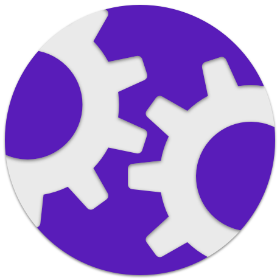

<p align="center">
    
</p>

<p align="center">
    
    <a href="https://swift.org/package-manager">
        
    </a>
     
    <a href="https://mastodon.social/@caddy">
        
    </a>
</p>

Welcome to **DCSettings**, a Swift package that simplifies the configuration of user preferences with an easy-to-use result builder syntax and a drop-in SwiftUI user interface.

You can configure settings in `UserDeafults`, `NSUbiquitousKeyValueStore` or a custom key-value store, like so: 

```swift
DCSettingsManager.shared.configure {
    DCSettingGroup("General") {
        DCSetting(key: "refreshInterval") {
            DCSettingOption(value: 5, label: "5 mins")
            DCSettingOption(value: 10, label: "10 mins")
            DCSettingOption(value: 15, label: "15 mins")
            DCSettingOption(value: 30, label: "30 mins").default()
            DCSettingOption(value: 60, label: "60 mins")
        }
        DCSetting(key: "articleListLayout") {
            DCSettingOption(value: "List", label: "List", systemImage: "list.bullet")
            DCSettingOption(value: "Grid", label: "Grid", systemImage: "square.grid.2x2")
        }
        DCSetting(key: "showImages", defaultValue: true)
        DCSetting(key: "showFullContent", defaultValue: false)
        DCSetting(key: "markAsReadOnScroll", defaultValue: true)
        DCSetting(key: "maxSyncItems", defaultValue: 1000)
    }
    DCSettingGroup("Appearance") {
        DCSetting(key: "theme", label: "Theme", options: ["Light", "Dark"])
        DCSetting(key: "fontSize", options: [12, 14, 16, 18, 20], defaultIndex: 2)
        DCSetting(key: "lineSpacing", defaultValue: 1.2, lowerBound: 1.0, upperBound: 1.6, step: 0.1)
        DCSetting(key: "highlightColor", defaultValue: Color.blue)
    }
}
```

Then use a **DCSettingsView** to display the settings in a list view:


```swift
DCSettingsView(includeSettingsWithoutLabels: true)
```

## Installation

To install **DCSettings**, add the following line to your `Package.swift` file:

```swift
dependencies: [
    .package(url: "https://github.com/davidcaddy/DCSettings.git", from: "0.1.0")
]
```

## Usage

To use `DCSettings` in your project, you’ll need to import it at the top of your Swift file like so:

```swift
import DCSettings
```

## Configuring Settings

To configure settings, you can use the `configure` method on an `DCSettingsManager` instance, typically the shared  singleton instance. This method takes a closure that returns an array of `DCSettingGroup` instances. Each `DCSettingGroup` can contain multiple `DCSetting` instances.

Here’s an example of how you might configure your settings:

```swift
DCSettingsManager.shared.configure {
    DCSettingGroup("General") {
        DCSetting(key: "showNotifications", defaultValue: true)
        DCSetting(key: "soundEffects", defaultValue: true)
        DCSetting(key: "shemeColor") {
            DCSettingOption(value: "Blue")
            DCSettingOption(value: "Red")
            DCSettingOption(value: "Green")
        }
    }
    .store(.standard)
    DCSettingGroup("Appearance") {
        DCSetting(key: "fontSize", defaultValue: 14)
        DCSetting(key: "fontName", defaultValue: "Helvetica")
    }
}
```

When configuring your settings you have several options available to you. First, you can create `DCSettingGroup` instances to group related settings together. Each `DCSettingGroup` can have a key and a label. The label is used to provide a human-readable name for the group. 

> It is recommended to avoid settings sepecfic keys for groups.

Within each `DCSettingGroup`, you can create `DCSetting` instances to represent individual settings. Each `DCSetting` has a key, a default value, and an optional label. The key is used to uniquely identify the setting, while the default value is used as the initial value for the setting if no value has been previously set. The label is used to provide a human-readable name for the setting. If no label is provided, a sentence cased string version of the key will be used as the label.

> Note: `DCSetting` supports the following types by default: `Bool`, `Int`, `Double`, `String`, `Date`, and `Color` (SwiftUI). You can also use custom types as they conform to the `Codable` protocol.

In addition to these basic properties, `DCSetting` instances can also have additional configuration options. These options are specified using the `DCSettingConfiguration` struct.

One of the options available in `DCSettingConfiguration` is the options property. This property allows you to specify an array of `DCSettingOption` instances that represent the list valid values for the setting. Each `DCSettingOption` has a value and can also have an optional label and image.

Another configuration option available in `DCSettingConfiguration` is the bounds property. This property allows you to specify a range of valid values for the setting using a `DCValueBounds` instance. A `DCValueBounds` instance has a lower bound and an upper bound that define the range of valid values.

Finally, `DCSettingConfiguration` also has a step property that allows you to specify the increment between valid values for the setting.

Here’s an example that shows how you might configure a setting with some of these options:

```swift
DCSettingsManager.shared.configure {
    DCSettingGroup(key: "General") {
        DCSetting(key: "themeColor") {
            DCSettingOption(value: "Blue", default: true)
            DCSettingOption(value: "Red")
            DCSettingOption(value: "Green")
        }
        DCSetting(key: "fontSize", defaultValue: 14, lowerBound: 10, upperBound: 20, step: 2)
    }
}
```

In this example, we’ve created a setting group for general settings and added two settings: one for the theme color and one for the font size. The theme color setting has three options: blue (the default), red, and green. The font size setting has a default value of 14 and a range of valid values from 10 to 20, with a step value of 2.

## Accessing Settings

Once you’ve configured your settings, you can access them elsewhere using the `DCStorage` property wrapper. Here’s an example of how you might access the ShowNotifications setting from the previous example:

```swift
@DCStorage("ShowNotifications") var showNotifications: Bool
```

You can also access settings directly using the `DCSettingsManager` `value(forKey:)` method. Here’s an example of how you might do this:

```swift
let showNotifications = DCSettingsManager.shared.bool(forKey: "ShowNotifications")
```

## Backing Stores

**DCSettings** allows you to specify which key-value store to use for each setting group and individual setting. By default, settings use the standard  key-value store, which is backed by `UserDefaults.standard`. However, you can specify a different key-value store by using the *store* property of a `DCSettingGroup` or `DCSetting`.

Here’s an example that shows how to use a custom key-value store backed by a `UserDefaults` instance with the suite name "com.example.myapp".

```swift
DCSettingsManager.shared.configure {
    DCSettingGroup(key: "General") {
        DCSetting(key: "ShowNotifications", defaultValue: true)
    }
    .store(.userDefaults(suiteName: "com.example.myapp"))
}
```

> Note: If no key-value store is specified for a setting group, the standard key-value store will be used.

You can also specify a custom key-value store for individual settings. Here’s an example that shows how to do this:

```swift
DCSettingsManager.shared.configure {
    DCSettingGroup(key: "General") {
        DCSetting(key: "ShowNotifications", defaultValue: true, store: .userDefaults(suiteName: "com.example.myapp"))
    }
}
```

> Note: If you specify a custom key-value store for a setting group, all settings within that group will use that key-value store, unless you specify a different key-value store for an individual setting.

**DCSettings** also supports using `NSUbiquitousKeyValueStore` as a key-value store for your settings, which is a key-value store that stores data in iCloud, allowing settings to be shared across multiple devices. Here’s an example that shows how to use `NSUbiquitousKeyValueStore` for a setting group:

```swift
DCSettingsManager.shared.configure {
    DCSettingGroup(key: "General") {
        DCSetting(key: "ShowNotifications", defaultValue: true)
        DCSetting(key: "SoundEffects", defaultValue: true)
    }
    .store(.ubiquitous)
}
```

## DCSettingsView

Once your settings are set up, you can quickly add a settings view to your app using `DCSettingsView`. This view displays a list of all the setting groups and settings that you’ve configured using the given `DCSettingsManager`. You can create an instance of this view and add it to your app’s view hierarchy like any other SwiftUI view.

Here’s an example that shows how you might create and use a `DCSettingsView`:

```swift
struct ContentView: View {
    var body: some View {
        DCSettingsView(includeSettingsWithoutLabels: true)
    }
}
```

> Note: By default, `DCSettingsView` will only display settings that have a label. If you want to display settings that don’t have a label, you can set the `includeSettingsWithoutLabels` parameter to `true`.

`DCSettingsView` has several customization options available. For example, you can specify an array of hidden keys to hide certain setting groups or individual settings. You can also provide a custom content provider to control how each setting is displayed.

Here’s an example that specifies that the “General” setting group should be hidden, by passing an array of hidden keys to the `DCSettingsView` initializer:

```swift
struct ContentView: View {
    var body: some View {
        DCSettingsView(hiddenKeys: ["General"])
    }
}
```

### Types

When you use a `DCSettingsView` to display your settings, each setting will be presented to the user using an appropriate control for its value type. Here’s a description of how each value type is presented:

- `Bool`: Settings with a Bool value type are presented as a toggle switch. The user can tap the switch to turn the setting on or off.
- `Int`: Settings with an Int value type are presented in several different ways depending on their configuration. If the setting has options, it will be presented as a segmented control or a popover menu, depending on the number of options. If the setting has value bounds, it will be presented as a slider. Otherwise, it will be presented as a stepper control.
- `Double`: Settings with an Int value type are presented in several different ways depending on their configuration. If the setting has options, it will be presented as a segmented control or a popover menu, depending on the number of options. Otherwiseit will be presented as a slider. The user can drag the slider to adjust the value of the setting.
- `String`: Settings with a String value type are presented in several different ways depending on their configuration. If the setting has options, it will be presented as a segmented control or a menu, depending on the number of options. Otherwise, it will be presented as a text field.
- `Date`: Settings with a Date value type are presented as a date picker. The user can tap the date picker to choose a date.
- `Color`: Settings with a Color value type are presented as a color picker. The user can tap the color picker to choose a color.

### Customization

When configuring a `DCSetting`, you can provide several additional options that affect how the setting is displayed within a `DCSettingsView`.

- `label`: The label property allows you to specify a human-readable name for the setting. This label is displayed next to the control for the setting within the `DCSettingsView`.
- `image`: The image property allows you to specify the name of an image to display next to the label for the setting within the `DCSettingsView`. This image should be included in your app’s asset catalog.
- `systemImage`: The systemImage property allows you to specify the name of a system-provided image to display next to the label for the setting within the `DCSettingsView`. This image should be one of the system-provided SF Symbols.
- `valueBounds`: The value bounds property allows you to specify a range of valid values for the setting. If you provide value bounds for a setting, the control for that setting within the `DCSettingsView` will be constrained to only allow values within that range. For example, if you provide value bounds for a numeric setting, the control for that setting will be a slider that only allows values within the specified range.
- `step`: The step property allows you to specify the increment between valid values for a numeric setting. If you provide a step value for a numeric setting, the control for that setting within the `DCSettingsView` will only allow values that are multiples of the step value.

### DCSettingViewProviding

`DCSettingViewProviding` is a protocol that allows you to provide custom views for individual settings within a `DCSettingsView`. To use this protocol, you’ll need to create a type that conforms to it and implement the `content(for:)` method.

The `content(for:)` method takes a `DCSettable` instance as its argument and returns an optional view. If you return a view from this method, it will be used when ppresenting the setting to the user. If you return `nil`, the default view for the setting will be used.

Here’s an example that shows how you might create a custom `DCSettingViewProviding` type:

```swift
struct MySettingViewProvider: DCSettingViewProviding {
    @ViewBuilder func content(for setting: any DCSettable) -> some View {
        if setting.key == "ShowNotifications", let concreteSetting = setting as? DCSetting<Bool> {
            Toggle("Show Notifications", isOn: concreteSetting.valueBinding())
        }
    }
}
```

In this example, we’ve created a `MySettingViewProvider` type that conforms to the `DCSettingViewProviding` protocol. In our implementation of the `content(for:)` method, we’re checking if the key of the setting is "ShowNotifications" and is a setting with a `Bool` value type. If it is, we’re returning a custom toggle view for the setting. For all other settings, we’re returning `nil`, which means that the default view for those settings will be used.

Once you’ve created your custom `DCSettingViewProviding` type, you can pass an instance of it to the `DCSettingsView` initializer to use it. Here’s an example that shows how you might do this:

```swift
struct ContentView: View {
    var body: some View {
        DCSettingsView(contentProvider: MySettingViewProvider())
    }
}
```

## Contributions

Before you start using **DCSettings**, it’s recommended you spend a few minutes familiarizing yourself with its documentation. Since this is a very young project, it’s likely to have some rough edges. Please do send through feedback on any issues you encounter.

Depending on scope and direction your contributions are more than welcome. If you wish to make a change, please open a Pull Request - even if just a rough draft of the proposed changes - and we can discuss it further.
